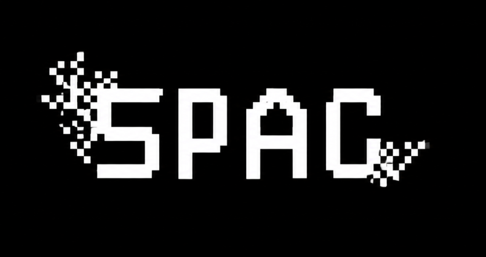
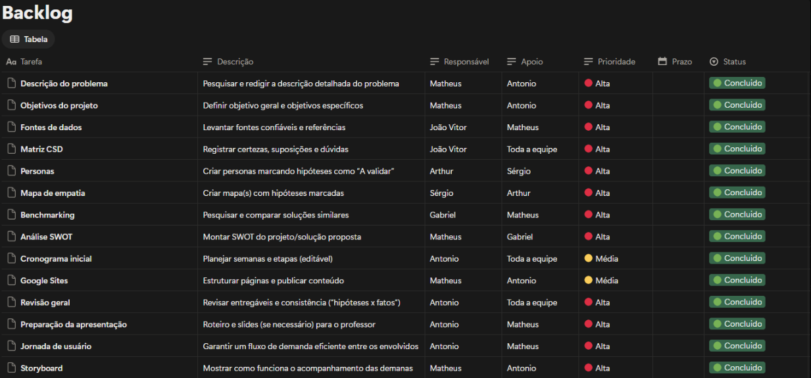
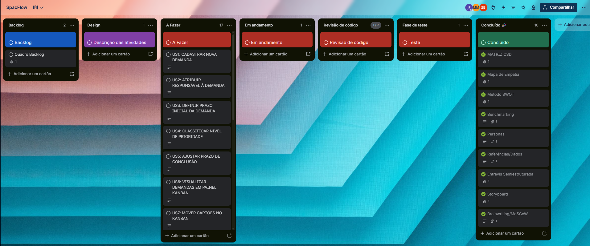

# 🔎 SpecFlow

## 📋 Contexto

O SpecFlow é um projeto acadêmico aplicado, desenvolvido em resposta a um problema real apresentado pela Vigilância em Saúde do Trabalhador (VISAT), vinculada à Secretaria de Saúde do Recife. A VISAT recebe constantemente demandas formais de órgãos de controle e articulação — como Ministério Público do Trabalho, Tribunal Regional do Trabalho, Conselhos de Saúde e Sindicatos — solicitando inspeções e pareceres técnicos, mas hoje esse controle é feito por processos administrativos gerais e planilhas internas, o que prejudica a rastreabilidade das demandas, o acompanhamento de prazos, a visualização da carga de trabalho da equipe e o retorno aos órgãos solicitantes e à sociedade. Para resolver isso, o SpecFlow propõe uma aplicação web para gestão e acompanhamento dessas demandas, com fluxo visual em Kanban, definição de responsáveis e prazos, anexos e histórico, além de indicadores gerenciais.

## ⚙️ Ferramentas tecnológicas

## 🔹 Funcionalidades

* Centralização de arquivos (PDFs, CSV e DOCX) para armazenamento e organização;
* Filtro de busca para localizar um processo específico, facilitando o manuseio pelo usuário;
* Gestão de prazos e priorização das demandas, com contagem de tempo e hierarquização de acordo com o que o cliente relatar na entrevista;
* Cadastro por função dentro da VISAT, atribuindo funcionalidades de acordo com o cargo (para casos de múltiplos cargos);
* Histórico de tudo que foi feito em cada demanda, registrando as atuações da equipe;
* Mensagens padronizadas para envio aos outros órgãos, garantindo feedback sobre as requisições;
* Cópias de segurança (backup), para evitar perda de dados;
* Indicadores gerenciais, com painel em tempo real das demandas em andamento e relatório mensal indicando o que foi cumprido dentro do prazo e onde há necessidade de ajustes de organização ou sobrecarga de atividades.

## 📽️ Demonstração do projeto

### 🔹 Tela Inicial

### 🔹 Tela da principal funcionalidade

### 🔹 Backlog

### 🔹 Board

## 🔗 Diagrama de atividades do sistema

## ⚙️ Issues e bugs tracker

## 🚀 Status do Projeto

## 👩‍💻 Equipe

* Antonio Leite Sandes — Gestor — als5@cesar.school
* Arthur Cabral Tietzman — Desenvolvedor — act2@cesar.school
* Gabriel Salvador Pereira da Silva Santos — Execução e teste — gspss@cesar.school
* João Vitor Rodrigues — Ideação/Pesquisador — jvrsf@cesar.school
* Matheus Figueiredo — Gestor — mffm@gmail.com
* Sérgio Bione de Almeida Bastos — Desenvolvedor — sbab@cesar.school
* Vitor Emmanuel Fernandes — Execução e teste — velfg@cesar.school
